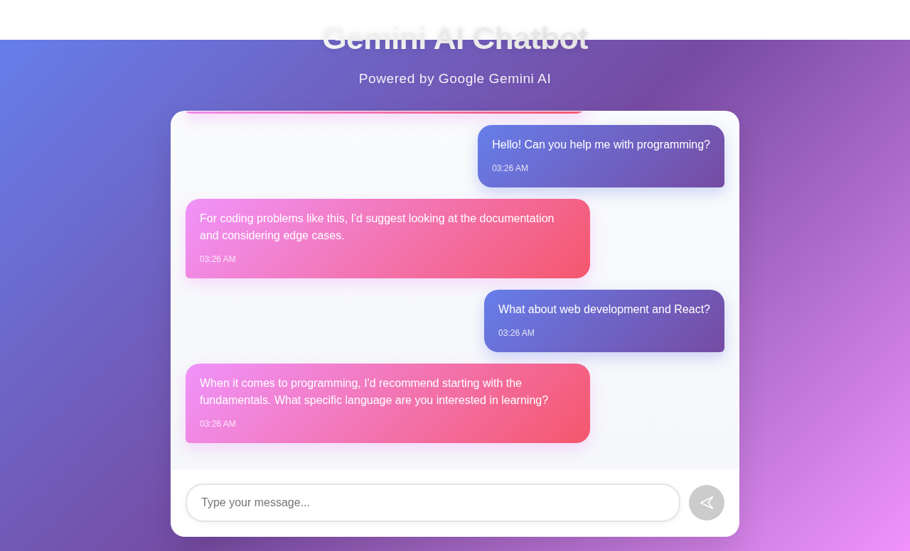
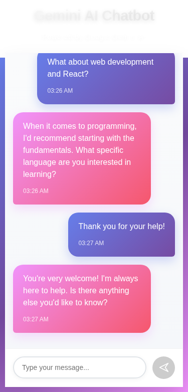
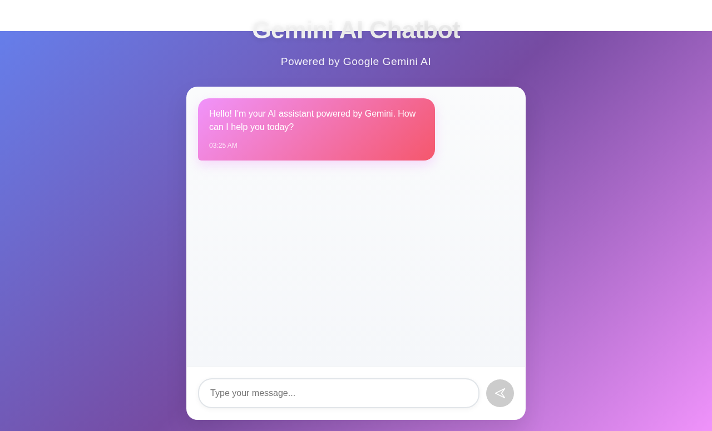

# Gemini AI Chatbot

A modern, responsive chatbot application built with React and Vite, featuring an attractive UI design and integration with Google Gemini AI (currently using dummy API responses for demonstration).

## Features

- 🤖 **AI-Powered Conversations**: Intelligent responses with contextual understanding
- 💬 **Real-time Chat Interface**: Smooth messaging experience with typing indicators
- 📱 **Responsive Design**: Optimized for both desktop and mobile devices
- 🎨 **Modern UI**: Beautiful gradient backgrounds and smooth animations
- ⚡ **Fast Performance**: Built with Vite for optimal loading speeds
- 🔄 **Real-time Updates**: Instant message delivery and status updates

## Screenshots

### Desktop View


### Mobile View


### Initial State


## Technology Stack

- **Frontend Framework**: React 19
- **Build Tool**: Vite
- **Styling**: Custom CSS with modern gradients and animations
- **AI Integration**: Google Gemini API (dummy implementation included)
- **Font**: Inter from Google Fonts

## Getting Started

### Prerequisites
- Node.js (v14 or higher)
- npm or yarn

### Installation

1. Clone the repository:
```bash
git clone <repository-url>
cd Chat-Bot
```

2. Install dependencies:
```bash
npm install
```

3. Start the development server:
```bash
npm run dev
```

4. Open your browser and navigate to `http://localhost:5173`

### Build for Production

```bash
npm run build
```

## Project Structure

```
src/
├── components/
│   ├── Chatbot.jsx          # Main chatbot component
│   └── Chatbot.css          # Chatbot styling
├── services/
│   └── geminiService.js     # AI service integration
├── App.jsx                  # Main app component
├── App.css                  # App styling
├── index.css               # Global styles
└── main.jsx               # App entry point
```

## API Integration

Currently, the app uses a dummy API service that simulates Gemini AI responses. To integrate with the actual Gemini API:

1. Get your API key from [Google AI Studio](https://aistudio.google.com/)
2. Create a `.env` file in the root directory:
```
VITE_GEMINI_API_KEY=your_api_key_here
```
3. Update the `geminiService.js` file to use the real API endpoints

## Customization

### Styling
- Modify `src/components/Chatbot.css` for chat interface styling
- Update `src/App.css` for overall app appearance
- Adjust `src/index.css` for global styles

### AI Responses
- Edit `src/services/geminiService.js` to customize response logic
- Add new response categories or improve contextual understanding

## Available Scripts

- `npm run dev` - Start development server
- `npm run build` - Build for production
- `npm run preview` - Preview production build
- `npm run lint` - Run ESLint

## Browser Support

- Chrome (recommended)
- Firefox
- Safari
- Edge

## Contributing

1. Fork the repository
2. Create a feature branch
3. Make your changes
4. Test thoroughly
5. Submit a pull request

## License

This project is open source and available under the [MIT License](LICENSE).

## Acknowledgments

- Built with React and Vite
- Powered by Google Gemini AI
- UI design inspired by modern chat applications
